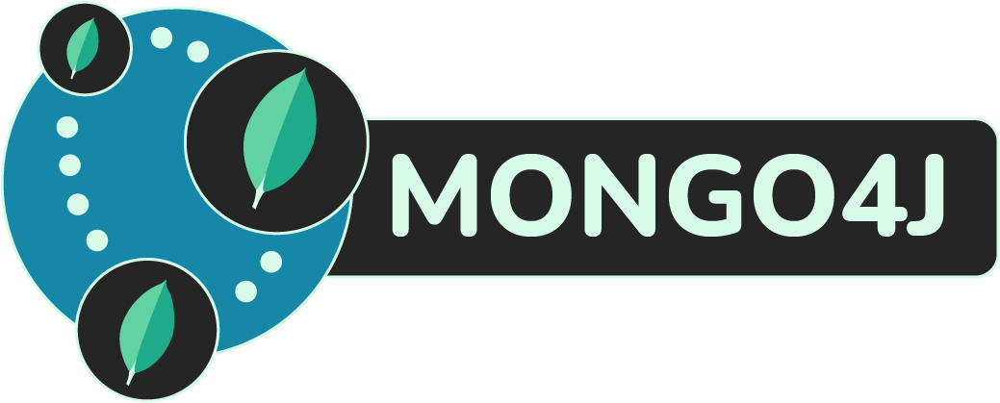

<p align="center">
  
</p>
<h1 align="center">Mongo4J</h1>

<p align="center" style="text-align: center;">
  <a href="https://github.com/SvenWesterlaken/mongo4j/actions"></a>
  <a href="https://coveralls.io/github/SvenWesterlaken/mongo4j?branch=master" rel="nofollow"></a>
  <a href="https://www.npmjs.com/package/mongo4j" rel="nofollow"></a>
  <a href="https://www.npmjs.com/package/mongo4j" rel="nofollow"></a>
</p>

<blockquote align="center">
  <p>A <a href="http://mongoosejs.com/" rel="nofollow">mongoose</a> plugin to automatically maintain nodes in <a href="https://neo4j.com/" rel="nofollow">neo4j</a></p>
</blockquote>

## Table of contents
- [Motivation](#motivation---why-mongo4j-another-library)
- [Installation](#installation)
- [Setup](#setup)
  - [Single driver](#single-driver)
  - [Multiple drivers](#multiple-drivers)
  - [Add the plugin to the schema](#add-the-plugin-to-the-schema)
- [Driver Management](#driver-management)
- [Schema configuration options](#schema-configuration-options)
  - [Standard Properties](#standard-properties)
  - [Relationships (References, Nested References & Subdocuments)](#relationships-references-nested-references--subdocuments)
- [Document Lifecycle](#document-lifecycle)
  - [Saving](#saving)
  - [Updating](#updating)
  - [Removing](#removing)
- [Methods](#methods)
  - [Static](#static)
- [Examples](#examples)
- [FAQ](#why-is-there-a-deletion-query-in-the-update-function)
- [Upcoming features & to-do-list](#upcoming-features--to-do-list)
- [Credits](#credits)

## Motivation - Why Mongo4J, another library?

The usage of mongo4j is found in the term [polyglot persistence](https://en.wikipedia.org/wiki/Polyglot_persistence). In this case, you will most likely want to combine the 'relationship-navigation' of neo4j while still maintaining documents in MongoDB for quick access and saving all information. Unfortunately, this also brings in extra maintenance to keep both databases in-sync. For this matter, several plugins and programs have been written, under which [moneo](https://github.com/srfrnk/moneo), [neo4j-doc-manager](https://neo4j.com/developer/neo4j-doc-manager/) & [neomongoose](https://www.npmjs.com/package/neomongoose).

These are great solutions, but I've found myself not fully satisfied by these. The doc manager, for example, needs another application layer to install and run it. The other two solutions were either out of date or needed a manual form of maintaining the graphs in neo4j. That's why I decided to give my own ideas a shot in the form of a mongoose plugin.

Mongo4J automatically updates, removes and adds graphs according to the given schema configuration. In addition to this, it adds extra functions to access the graphs from the models through mongoose. This way, there is no need to keep two different approaches to the neo4j-database.

## Installation

Download and install the package with npm:
```bash
npm install --save mongo4j
```

## Setup

Before you use (require) mongo4j anywhere, **First initialize it with drivers**.

This creates the singleton pattern lifecycle of driver(s) stated by the [neo4j-driver library](https://github.com/neo4j/neo4j-javascript-driver#usage-examples).

Same options can be used as the official driver and there is the possibility of initializing multiple drivers in the beginning. Which should be **only one driver per neo4j database**. Options can be found on the neo4j driver [documentation](https://neo4j.com/docs/api/javascript-driver/current/function/index.html#static-function-driver).

### Single driver

#### mongo4j.init(host, auth, options)
- `host` - Url to neo4j database. Defaults to `neo4j://127.0.0.1`
- `auth` - Authentication parameters:
  - `user` - User for neo4j authentication. Defaults to `neo4j`
  - `pass` - Password for neo4j authentication. Defaults to `neo4j`
- `options` - Options for neo4j driver. These can be found in the [documentation](https://neo4j.com/docs/api/javascript-driver/current/function/index.html#static-function-driver).

```javascript
const mongo4j = require('mongo4j');

mongo4j.init('neo4j://localhost', {user: 'neo4j', pass: 'neo4j'});
```

### Multiple drivers

#### mongo4j.init(hosts, auth, options)

- `hosts` - Array of hosts. A host in this case consists of:
  - `name` - Identifier to reference this specific driver. _(Must be a string)_ **Required**
  - `url` - Url to neo4j database. Defaults to `neo4j://127.0.0.1`
  - `auth` - Authentication parameters:
    - `user` - User for neo4j authentication. Defaults to `neo4j`
    - `pass` - Password for neo4j authentication. Defaults to `neo4j`
  - `options` - Options for neo4j driver. These can be found in the [documentation](https://neo4j.com/docs/api/javascript-driver/current/function/index.html#static-function-driver).
- `auth` - Authentication parameters. _Will be overwritten by individual authentication set in hosts_:
  - `user` - User for neo4j authentication. Defaults to `neo4j`
  - `pass` - Password for neo4j authentication. Defaults to `neo4j`
- `options` - Options for neo4j driver. These can be found in the [documentation](https://neo4j.com/docs/api/javascript-driver/current/function/index.html#static-function-driver). _Will be overwritten by individual options set in hosts_

In the case of multiple drivers make sure you initialize every driver with an identifier (name) in string format for later re-use, otherwise, an error will be thrown.

```javascript
const mongo4j = require('mongo4j');

mongo4j.init(
  [{
    name: 'testconnection1',
    url: 'neo4j://127.0.0.1',
    auth: {
      user: 'neo4j',
      pass: 'neo4j'
    }
  }, {
    name: 'testconnection2',
    url: 'neo4j://127.0.0.1'
  }]
);
```

Authentication can be specified as a second argument to use the same authentication for all drivers. Authentication set per host will override these global authentication settings.

The same goes for options. If you only want to use shared options, make sure you pass `null` as a second argument:

```javascript
const mongo4j = require('mongo4j');

// connectionPoolSize is set for both drivers
mongo4j.init([host1, host2], null, {connectionPoolSize: 100});
```

### Add the plugin to the schema

#### CustomSchema.plugin(moneo.plugin(identifier))
- `identifier` - Identifier to reference the specific driver to use _(in case of multiple drivers)_.

```javascript
// Use the default driver connection (in case of one driver)
PersonSchema.plugin(mongo4j.plugin());

// Use the 'testconnection1' driver to connect to neo4j
PersonSchema.plugin(mongo4j.plugin('testconnection1'))
```

## Driver management
These functions will help manage the drivers for neo4j.

#### mongo4j.getDriver(identifier)
- `identifier` - Identifier to reference the specific driver. Can also be an integer. **Required in case of multiple drivers**

**Returns:** a driver. In the case of multiple drivers. It will return an `Object` like:
```javascript
{
  name: 'testconnection1', // Identifier
  driver: //Neo4JDriver
}
```

```javascript
// Get driver in case of only one
mongo4j.getDriver();

// Get testconnection1 driver in case of multiple
mongo4j.getDriver('testconnection1');

// Get testconnection1 driver in case of multiple with integer identifier
// NOTE: identifier = index + 1
mongo4j.getDriver(1);
```

#### mongo4j.close(identifier)
- `identifier` - Identifier to reference the specific driver. Can also be an integer or `true` to close all drivers at once. **Required in case of multiple drivers**

**Returns:** a single `Promise` (also in case of multiple drivers).

```javascript
// Close driver in case of only one
mongo4j.close();

// Close testconnection1 driver in case of multiple
mongo4j.close('testconnection1');

// Close testconnection1 driver in case of multiple with integer identifier
// NOTE: identifier = index + 1
mongo4j.close(1);

// Close all drivers in case of multiple
mongo4j.close(true);
```

#### mongo4j.reset()
**Returns:** a single `Promise` (also in case of multiple drivers).

```javascript
// Close all drivers and set drivers to undefined in mongo4j context
mongo4j.reset();
```

## Schema configuration options

After you have added mongo4j as a plugin to your document schema there are several properties to configure which and how data of the document is saved in neo4j.

### Standard Properties
These options apply to simple schema properties.

#### neo_prop: `Boolean`
- Defaults to `false`.
- If set to `true` this property will be saved in neo4j.
- **Note:** the `_id` property in MongoDB will automatically be added as `m_id` in neo4j.

```javascript
// Save firstName as a property in neo4j
const PersonSchema = new Schema({
  firstName: {
    type: String,
    neo_prop: true
  }
});
```

### Relationships (References, Nested References & Subdocuments)
References, nested references & subdocuments are automatically saved as different nodes as explained [here](#saving).
Therefore there are several options to configure how to relationship is saved.

#### neo_rel_name: `String`
- Defaults to `[PROPERTY NAME]_[DOCUMENT TYPE]_[RELATED DOCUMENT TYPE]`. ie: `SUPERVISOR_CLASS_PERSON`
- **Note:** relationships will be converted to uppercase to conform to the neo4j naming conventions.

```javascript
// Results in 'TAUGHT_BY' relationship
const ClassSchema = new Schema({
  teacher: {
    type: mongoose.Schema.ObjectId,
    ref: 'Person',
    neo_rel_name: "Taught By"
  }
});

// NOTE: CLASS refers to class mongo model, not an actual Javascript class.
// Results in 'SUPERVISOR_CLASS_PERSON' relationship (including a start_date property)
const ClassSchema = new Schema({
  supervisor: {
    person: {
      type: mongoose.Schema.ObjectId,
      ref: 'Person'
    },
    start_date: Date
  },
});
```

#### neo_omit_rel: `Boolean`
- Defaults to `false`.
- If set to `true` this relationship will not be saved (omitted) in neo4j.

```javascript
// Don't save the relationship to teacher in neo4j (the teacher can still be saved separately)
const ClassSchema = new Schema({
  teacher: {
    type: mongoose.Schema.ObjectId,
    ref: 'Person',
    neo_omit_rel: true
  }
});
```

## Document lifecycle

### Saving

Saving a mongo-document in neo4j is executed as you would normally. Therefore, return values will still be the same as without mongo4j. Post hooks of `Document.save()` & `Model.insertMany()` will cause the saved document(s) to be saved in neo4j as well.

**Note:** The hooks for saving in neo4j are executed asynchronously.

```javascript
const Person = require('path/to/models/person');

neil = new Person({
  firstName: "Neil",
  lastName: "Young",
  address: {
    city: "Brentwood",
    street: "Barleau St."
  }
});

// Save 'neil' as a node in neo4j (as well as MongoDB) according to the schema configuration
neil.save();

const henry = new Person({firstName: "Henry", lastName: "McCoverty"});
const daniel = new Person({firstName: "Daniel", lastName: "Durval"});
const jason = new Person({firstName: "Jason", lastName: "Campbell"});

// Save all three persons in neo4j as well as MongoDB
Person.insertMany([daniel, jason, henry]);
```

### Updating

Unfortunately, mongoose doesn't supply a direct way of accessing data in update hooks. Therefore a custom method on the document will be used that will both handle the saving in MongoDB and neo4j. It can be seen as a wrapper around the original `Document.updateOne()` method.

#### Document.updateNeo(criteria, options, cb)
- **Note**: parameters are identical to that of `Model.updateOne()`. Detailed documentation can therefore be found [here](https://mongoosejs.com/docs/api.html#document_Document-updateOne).
- `criteria`: Data that should be changed _(json format)_
- `options`: options for the `updateOne()` method executed. Refer to the [documentation](https://mongoosejs.com/docs/api.html#query_Query-setOptions) of mongoose for available options.
- `cb`: Callback function to be executed by the `updateOne()` method.

**Returns:** a promise with a result of an array containing (in order):
- Result of the updateOne method. See [documentation](https://mongoosejs.com/docs/api.html#document_Document-updateOne)
- Result of the cypher update query
- Result of the cypher query that deleted all the previous relationships. **(If not executed this will be null)**. Why this query is executed is explained [here](#why-is-there-a-deletion-query-in-the-update-function).

```javascript
// variable `person` refers to a document fetched from the database or returned as a result after saving

// Update the firstname to 'Peter' and lastname to 'Traverson'.
person.updateNeo({firstName: 'Peter', lastName: 'Traverson'}).then((results) => {
  // First item of the array is the result of the update query by mongoose
  let mongoUpdateResult = results[0];

  // Second item of the array is the result of the neo4j cypher query for updates
  let neo4jUpdateResult = results[1];

  // Third item of the array is the result of the delete query. In this case null,
  // because the updates didn't involve any changes in relationships between nodes.
  let neo4jDeleteResult = result[2];
});
```

### Removing

Removing a mongo-document in neo4j is executed as you would normally. Post hooks of `Document.remove()` will cause the removed document(s) to be removed in neo4j as well (including subdocuments & relationships; not the related docs, of course).

```javascript
// Remove 'neil' from neo4j as well as mongo
neil.remove()
```

## Methods
### Static
These methods can be called without an instance of an object. In other words, straight from the model.

#### Model.cypherQuery(query, params, options)
- `query`: Cypher query to execute in string format.
- `params`: Parameters of the query. More info on this in the neo4j [driver-manual](https://neo4j.com/docs/driver-manual/current/cypher-workflow/#driver-queries-results)
- `options`: Object with the following options for the query:
  - `sub`: Return a subscription. Can be used as explained [here](https://github.com/neo4j/neo4j-javascript-driver#consuming-records-with-streaming-api). Defaults to `false`
  - `parse`: Parse result with [parse-neo4j](https://www.npmjs.com/package/parse-neo4j). This is only available in the case of a Promise. If both options are `true` the query will throw an error. Defaults to `false`

**Returns:** a `Promise` with the result of the [cypher query](https://github.com/neo4j/neo4j-javascript-driver#consuming-records-with-promise-api). _or a subscription in case of sub-options set to `true`._

**Note**: The session is automatically closed after the query, _**only in the case of a promise!**_

```javascript
const Person = require('./models/person');

// Basic usage with a cypher query
Person.cypherQuery('MATCH (n:Person)-[r:Takes_Class]-(c:Class) return n;')
  .then(result => {
    result.records.forEach(record => {
      console.log(record.get('name'))
    })
  })
  .catch(error => {
    console.log(error)
  })
```
```javascript
// Run query with parse on for the result & using parameters for the query
Person.cypherQuery('MATCH (n:Person {name: $nameParam }) RETURN n;', {nameParam: 'James'}, { parse: true });
  .then(result => {
    result.records.forEach(record => {
      console.log(record.get('name'))
    })
  })
  .catch(error => {
    console.log(error)
  })
```
```javascript
// Run query with sub on to handle the cypher query with the stream api
Person.cypherQuery('MATCH (n:Person) RETURN n;', { sub: true })
  .subscribe({
    onKeys: keys => {
      console.log(keys)
    },
    onNext: record => {
      console.log(record.get('name'))
    },
    onCompleted: () => {
      session.close() // returns a Promise
    },
    onError: error => {
      console.log(error)
    }
  })
```

## Examples
For examples, refer to the [test cases](test/functions/) & [test models](test/models) for now.

## FAQ
### Why is there a deletion query in the update function?
After trying a couple of times, I couldn't find a consistent way of determining what nodes or relationships have changed and to what.
At the time (may still be) the data also couldn't fit into a single query.
In order to maintain flexibility and speed, a delete query has been added before refilling the neo4j database with the new relationships, nodes & data.

## Upcoming features & to-do-list
Unfortunately, I don't have much time for keeping this repo up-to-date. However, from time to time I will try to have a look and see where I can fix or expand features. Right now all of the functionality described should work correctly and should cover the basic needs for scenarios where this package would be used.

**Feel free to contribute by picking something from the to-do-list below and making a pull-request!**
_I will check these every now and then_

#### To-do-list:

- Wrappers around static functions of a model (adding, updating & deleting)
- Code documentation
- Debug Mode (ie. show neo4j query's)
- Helper functions for neo4j access
- State hooks
- Work with the new reactive sessions from neo4j

## Credits

Big shoutout to [srfrnk](https://github.com/srfrnk) for creating the repo called [moneo](https://github.com/srfrnk/moneo).

After some digging through the code, I missed some functionality and saw that the old HTTP driver for neo4j was used.
I decided to rewrite the code with extra functionality and use the [new neo4j driver](https://github.com/neo4j/neo4j-javascript-driver) with _'bolt'_ connection.

Moneo has provided me with the basic info to get started and mongo4j could be seen as a (continued) **version 2.0**.
